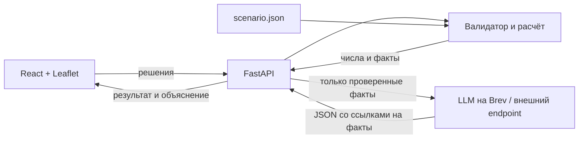

# Архитектурные решения

## Поток данных

Nginx — единая точка входа. В dev его заменяет Vite с proxy `/api`. CORS для такой схемы не требуется. База данных не нужна: сценарий целиком определяется версией исходных данных и набором решений.

## Что считается на сервере

`validate` проверяет бизнес-правила. `calculate` — внутренняя функция, принимающая также подмножества для базовой оценки и метода Шепли. Публичный `simulate` всегда вызывает валидатор до расчёта пользовательского Score. Неполные наборы не получают итоговую оценку.

Значения не округляются между шагами. Clip выполняется после всех эффектов и синергий. Влияние районной меры масштабируется населением только на стадии городского среднего. Синергии привязаны к району первой меры пары, без лага. Все направления и правила находятся в одном JSON.

`contributions` использует точные значения Шепли для пяти выбранных мер (32 подмножества). Это устраняет зависимость вклада от порядка добавления и распределяет нелинейные эффекты: минимум района, устранение критических дефицитов, синергии.

`suggestions` перебирает все одиночные замены и районы, валидирует кандидатов и возвращает лучшие улучшения. ИИ может сослаться на эти варианты, но не создать собственный непроверенный набор.

## Граница доверия ИИ

`/analyze` принимает решения и заново вычисляет результат. Пользователь не может передать модели выдуманный Score через этот API. Модель отвечает по схеме Report, с идентификаторами фактов. Вывод не исполняется как HTML; React экранирует текст. Цифры в текстах ответа запрещены проверкой; числовые карточки берутся из серверных фактов.

Такая проверка не доказывает семантическую верность прозы. Новую модель нужно проверить на примерах со штрафами, отрицательными эффектами и синергиями. При ошибках транспорта, неизвестных ссылках или нарушении формата возвращается явно обозначенный расчётный отчёт. LLM не может изменить Score.

## Осознанные ограничения первой версии

- Пять районов из синтетического задания; точки на карте приблизительные. Реальная административная география может отличаться.
- Эффекты на горизонте считаются формулой задания; помесячная или поквартальная динамика не моделируется.
- Нет учётных записей, общего leaderboard, записи в БД и загрузки экспортированного JSON.
- GPU-профиль требует отдельного теста на реальном Brev-инстансе; его наличие не означает, что облачная машина уже запущена.
- Публичное размещение с платной моделью потребует ограничения запросов и контроля доступа.
